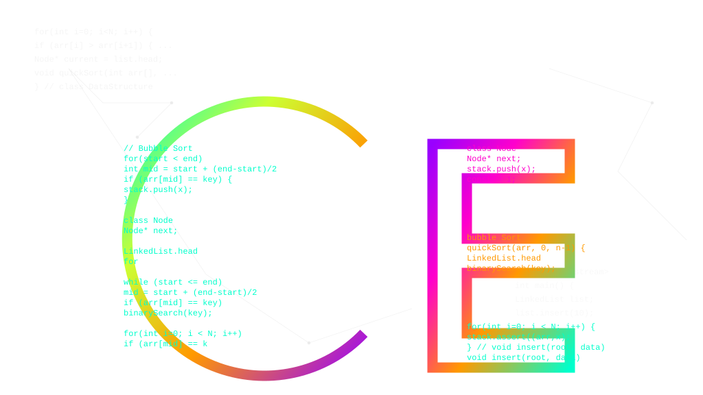

#   Codex Environment

Codex Environment is a comprehensive Data Structures and Algorithms (DSA) learning platform designed to provide an interactive and immersive educational experience. It features algorithm visualizations, an AI-powered practice arena with Socratic hints, and a multi-language code execution engine.

## 🚀 Features

- **Algorithm Visualizer**: Interactive step-by-step visualizations for Sorting, Searching, Stacks, Queues, Linked Lists, Trees, Graphs, and more.
- **AI Practice Arena**: Solve coding problems with real-time feedback.
  - **Socratic Hints**: AI-powered hints that guide you towards the solution without giving it away.
  - **Code Review**: Instant AI code reviews analyzing correctness, complexity (Time/Space), and style.
- **Code Execution Engine**: Run code securely in JavaScript, Python, Java, and C++.
- **Interactive Tutorials**: Learn concepts like Big O notation and Recursion through interactive modules.
- **Adaptive Learning Coach**: Personalized next actions, skill profile, mistake intelligence, revision calendar, mixed practice, and interview mode.
- **Learner Intelligence**: Tracks mistake tags, hint usage, approach snapshots, pattern mastery, readiness score, and learning timeline events.
- **Content Studio Foundation**: Admin-protected APIs and UI shell for managing questions, patterns, concept checks, and learning tracks.
- **Modern UI**: Polished Glassmorphism design system using Tailwind CSS and Framer Motion.

## Learning Coach Architecture

The platform now centers on a learner-first coaching loop:

1. **Practice**: Learners solve normal, revision, mixed-pattern, or interview-mode problems.
2. **Detect**: Submissions create deterministic mistake insights such as edge-case failure, complexity issue, pattern misunderstanding, and syntax/runtime issues.
3. **Adapt**: Coach APIs calculate mastery, skill profile, readiness score, weak patterns, and ranked next actions.
4. **Revise**: Revision items use spaced intervals based on wrong answers, hint-supported solves, and clean solves.
5. **Reflect**: Practice Arena includes AI mentor chat and a timeline of submissions, hints, mentor messages, and accepted solutions.

Important API areas:

- `/api/coach/me/dashboard`, `/api/coach/me/skill-profile`, `/api/coach/me/mistakes`, `/api/coach/me/next-actions`
- `/api/revision/me`, `/api/revision/me/:id/complete`, `/api/revision/me/:id/skip`, `/api/revision/me/:id/reschedule`
- `/api/questions/mixed`, `/api/questions/:questionId/timeline/me`
- `/api/patterns/:slug/concept-checks`, `/api/coach/me/concept-checks/attempt`
- `/api/ai/mentor/message`, `/api/ai/mentor/session/:questionId`
- `/api/interview/start`, `/api/interview/:id/run`, `/api/interview/:id/finish`, `/api/interview/me`
- `/api/admin/questions`, `/api/admin/patterns`, `/api/admin/concept-checks`, `/api/admin/tracks`

## 🛠️ Tech Stack

### Frontend
- **Framework**: React (Vite)
- **State Management**: Redux Toolkit
- **Styling**: Tailwind CSS
- **Code Editor**: Monaco Editor (@monaco-editor/react)
- **Animations**: Framer Motion
- **Icons**: Lucide React
- **Charts**: Recharts

### Backend
- **Server**: Node.js & Express
- **AI Integration**: Google Generative AI 
- **Security**: Helmet, CORS, Rate Limiting
- **Execution**: Child Processes for multi-language code execution

## 📋 Prerequisites

- Node.js (v18+ recommended)
- npm or yarn
- Google Gemini API Key (for AI features)

## 📦 Installation & Setup

### 1. Clone the Repository
```bash
git clone <repository-url>
cd Codex Environment
```

### 2. Backend Setup
The backend runs the API server and code execution engine.

1. Navigate to the server directory:
   ```bash
   cd backend/server
   ```
2. Install dependencies:
   ```bash
   npm install
   ```
3. Create a `.env` file in `backend/server/` with the following variables:
   ```env
   PORT=3000
   GEMINI_API_KEY=your_gemini_api_key_here
   FRONTEND_URL=http://localhost:5173
   ```
   *(Note: Replace `your_gemini_api_key_here` with your actual key from [Google AI Studio](https://makersuite.google.com/app/apikey))*

4. Start the server:
   ```bash
   npm run dev
   ```
   The server will start at `http://localhost:3000`.

### 3. Frontend Setup
The frontend provides the user interface.

1. Open a new terminal and navigate to the frontend directory:
   ```bash
   cd frontend
   ```
2. Install dependencies:
   ```bash
   npm install
   ```
3. Start the development server:
   ```bash
   npm run dev
   ```
   The application will be available at `http://localhost:5173`.

## 📂 Project Structure

```
Codex Environment/
├── frontend/            # React + Vite application
│   ├── src/             # Source code (Components, Store, Pages)
│   ├── public/          # Static assets
│   └── package.json     # Frontend dependencies
├── backend/             # Backend services
│   ├── server/          # Express API server
│   │   ├── data/        # JSON data files (Algorithms, Questions)
│   │   ├── index.js     # Server entry point
│   │   └── package.json # Backend dependencies
│   └── scripts/         # Utility scripts
└── README.md            # Project documentation
```

## 🔒 Security Note
The code execution engine runs user-submitted code on the server. While basic timeouts and cleanup are implemented, this is intended for a controlled educational environment.

## 🤝 Contributing
Contributions are welcome! Please open an issue or submit a pull request for any improvements or bug fixes.
